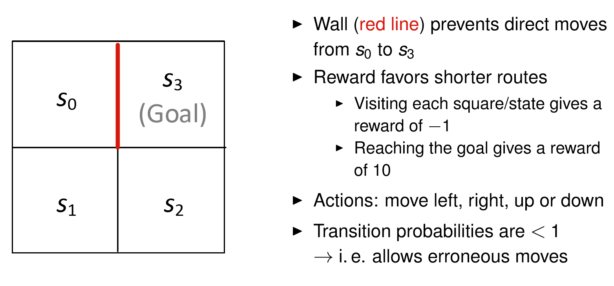

[Script Uni Freiburg](https://www.is.uni-freiburg.de/ressourcen/business-analytics/13_reinforcementlearning.pdf)
  
[GitHub Package](https://github.com/cran/MDPtoolbox)

# Load `MDPtoolbox`
```{r}
library(MDPtoolbox)
```

# Example Simple
* 2 stages: $S_1, S_2$  
* 2 actions: $a_1, a_2$


### Reward Matrix
* $S_1$ has a reward of -5 taking action $a_1$ AND a reward of 10 when taking action $a_2$  
* $S_2$ has a reward of 10 taking action $a_1$ AND a reward of -5 when taking action $a_2$
* result in a 2 dimensionial matrix `R`: $|states| \times |actions| = 2 \times 2$

```{r}
R <- matrix(c(-5, 10, 10, -5),
            nrow = 2, ncol = 2, byrow = TRUE,
            dimnames = list(c("S1", "S2"),
                            c("a1", "a2"))) 
R
```

### Transition matrix
Create transition matrix for two states and two actions:
Dimensions are $|states| \times |states| \times |actions| = 2 \times 2 \times 2$
```{r}
T <- list(a1 =matrix(c(0, 1, 0.8, 0.2), nrow = 2, ncol = 2, byrow = TRUE),
          a2 =matrix(c(0.5, 0.5, 0.1, 0.9), nrow = 2, ncol = 2, byrow = TRUE))
T
```


### Check 
whether the given `T` and `R` represent a **well-defined MDP**  

> Returns an empty string if the MDP is valid

```{r}
mdp_check(T, R)

```

### Run Value Iteration 
with function `mdp_value_iteration()`
` 
```{r}
# model <- mdp_policy_iteration(P = T, R = R, discount = 0.9)
model <- mdp_value_iteration(P = T, R = R, discount = 0.9)
model$iter
```

$V$ Values:
```{r}
model$V
```

$\pi(S)$ Optimal Policy
```{r}
matrix(c("S1", "S2", names(T)[model$policy]), nrow = 2, dimnames = list(NULL,c("State", "Action")))
```


***

# Value Iteration
Learning an agent traveling through a 2×2 grid (i.e. 4 states)



Design an MDP that Finds the optimal policy

### Reward Matrix
Grid world:
```{r, echo=FALSE}
matrix(c(-1,-1,10,-1), nrow = 2, byrow = FALSE)
```
As parameter:  

* $|stage| \times|action|$  
* $action \in (up,left,down,right)$  
* $stage \in \{S_0, S_1, S_1, S_3 \}$

```{r}
R <- matrix(c(-1, -1, -1, -1, -1, -1, -1, -1, 10, -1, -1, -1, 10, 10, -1, 10), 
            nrow=4, ncol=4, byrow=TRUE,
            dimnames = list( c("S0", "S1", "S2", "S3") ,c("up", "left", "down", "right"))) 
R
```

### Transition Matrix
Create individual matrices with pre-specified (random) transition probabilities for each action:
```{r}
up <- matrix(c( 1, 0, 0, 0, 0.7, 0.2, 0.1, 0, 0, 0.1, 0.2, 0.7, 0, 0, 0, 1), nrow=4, ncol=4, byrow=TRUE)
left <- matrix(c(0.9, 0.1, 0, 0, 0.1, 0.9, 0, 0, 0, 0.7, 0.2, 0.1, 0, 0, 0.1, 0.9), nrow=4, ncol=4, byrow=TRUE)
down <- matrix(c(0.3, 0.7, 0, 0, 0, 0.9, 0.1, 0, 0, 0.1, 0.9, 0, 0, 0, 0.7, 0.3), nrow=4, ncol=4, byrow=TRUE)
right <- matrix(c(0.9, 0.1, 0, 0, 0.1, 0.2, 0.7, 0, 0, 0, 0.9, 0.1, 0, 0, 0.1, 0.9), nrow=4, ncol=4, byrow=TRUE) 
T <- list(up=up, left=left, down=down, right=right)
T
```


### MDP Check
```{r}
mdp_check(T, R) # empty string => ok

```

### Value Iteration
with discount factor $\gamma = 0.9$
```{r}
m <- mdp_value_iteration(P = T, R = R, discount = 0.9)
m$time
m$iter
m$V
```

$\pi(S)$
```{r}
matrix(c("S0", "S1", "S2", "S3", names(T)[m$policy]), 
       nrow = 4,
       byrow = FALSE ,  dimnames = list(NULL, c("Stage", "Action")))
```

